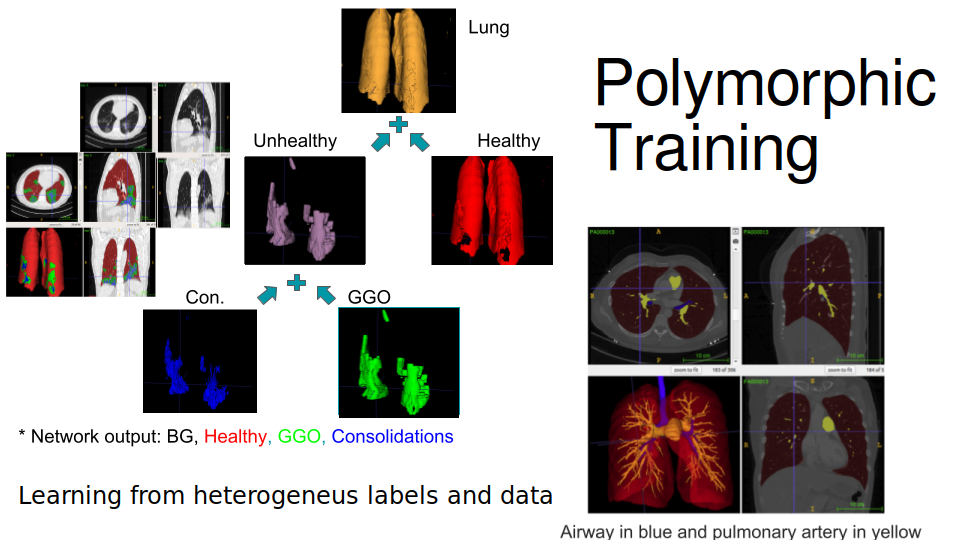
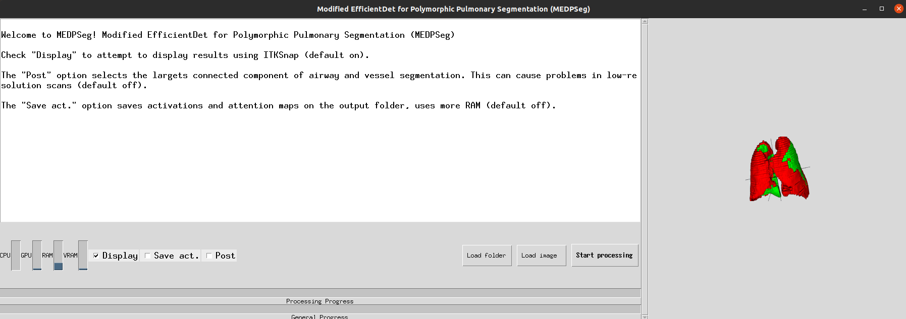
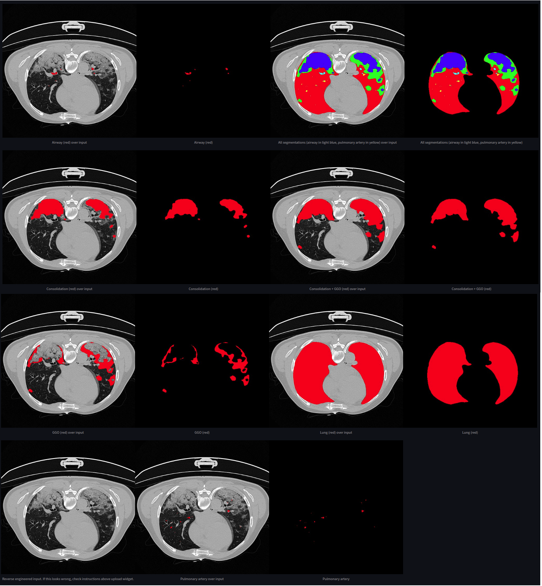

# Modified EfficientDet for Polymorphic Pulmonary Segmentation (MEDPSeg): Hierarchical polymorphic multitask learning for the segmentation of ground-glass opacities, consolidation, and pulmonary structures on computed tomography
Welcome to MEDPSeg. This is a new version of our old [MEDSeg](https://github.com/MICLab-Unicamp/medseg) methodology. In our work, we take advantage of the hierarchical nature of lesion annotation inside the lung to optimize over heterogeneous data and labels! Multitasking of pulmonary artery and airways is also involved. In this repository you can reproduce trained MEDPSeg's automated segmentation capabilities using a graphical tool or command line interface, installed through pip. 

## Paper

The manuscript for this method is under submission, but you can check our [arXiv pre-print](https://arxiv.org/abs/2312.02365)!

## Citation

    @misc{carmo2024medpseg,
      title={MEDPSeg: Hierarchical polymorphic multitask learning for the segmentation of ground-glass opacities, consolidation, and pulmonary structures on computed tomography}, 
      author={Diedre S. Carmo and Jean A. Ribeiro and Alejandro P. Comellas and Joseph M. Reinhardt and Sarah E. Gerard and Letícia Rittner and Roberto A. Lotufo},
      year={2024},
      eprint={2312.02365},
      archivePrefix={arXiv},
      primaryClass={eess.IV}
      }

## Requirements

This tool was tested on Ubuntu 20.04, 22.04 and Windows 10. The following instructions refer to quickly running the tool installing it with Miniconda and pip. Minimum RAM requirement in high resolution CT is 16 GB, with 32 GB recommended. Minimum GPU memory requirements for running on the GPU is 6 GB, with at least 8 GB recommended. Dependencies installed during setup are on the requirements.txt file. 

### Miniconda

We recommend using a Miniconda/Anaconda environment for installation. To install Miniconda for Windows or Linux follow the instructions in: https://docs.conda.io/en/latest/miniconda.html. If you are on windows. All following commands should be executed in Anaconda Prompt (bundled with miniconda). We recommend you create an environment specific to running MEDPSeg to avoid messing your existing environment. This can be done with, for example:

    conda create -n medpseg python=3.8

MEDPSeg has been tested with Python > 3.8, up to 3.11. We provide a Dockerfile for an example usage with a Docker environment but it has not been tested for the current version yet. 

### GPU Usage: PyTorch setup

Now, install torch with CUDA GPU support. It can be easily installed with a single command depending on your environment. This depends on what GPU you are using and its driver version and support for newer or older CUDA versions. Follow the instructions for your OS and CUDA support of your GPU driver on http://www.pytorch.org/. Either PyTorch 1.12.1 or 2.x should work.

If you don't want to use a GPU, you can skip this part and trust the automatic installation of dependencies.

## Installation

The following command lines should do all remaining installation steps. Do these steps AFTER you have an environment with PyTorch working with GPU support.

First, clone the repository:

    git clone https://github.com/MICLab-Unicamp/medpseg

 Then, due to the large size of network weights, you need to go into the Releases in this repository, download the [data_poly.zip](https://github.com/MICLab-Unicamp/medpseg/releases/download/v4.0.0/data_poly.zip) file, and put it inside the medpseg folder. This can be done through the command line with: 
    
    cd medpseg/medpseg
    wget https://github.com/MICLab-Unicamp/medpseg/releases/download/v4.0.0/data_poly.zip

Extract the .ckpt files inside the medpseg/medpseg folder. The .ckpt files should be in the same directory level as the run.py file.

    unzip data_poly.zip

Finally, go into the top level folder (with the setup.py file) and install the tool with "pip install . ". 

    cd ..
    pip install .

pip install . will fail if the .ckpt files are not in the correct directory. 

The above commands require git, unzip and wget which can be installed in Ubuntu with 

    sudo apt install git wget unzip

## Running 

To run, just call it in a terminal.

    medpseg

If you don't want to use a GPU, run this command:

    medpseg_cpu

The above commands should launch a Graphical User Interface (GUI). Following is how the GUI will look like:

If you don't want to use the GUI, give --input_folder/-i and --output_folder/-o arguments to run in a folder of exams. Check the --help command for more details and help in general for using the command line interface.

Outputs will include a general report in the form of a .csv sheet and the masks for all targets in .nii.gz format. Below is a rendering for PARSE scan 013 and CoronaCases scan 003.

Outputs for PARSE013       |  Outputs for CoronaCases003
:-------------------------:|:-------------------------:
  |  

## Evaluation

Check our evaluation reproducibility code for CoronaCases and SemiSeg test results in this .

## Running in .JPG/.PNG images

We do not recommend you run using common image files, since the tool was developed with 2.5D prediction over 3D volumes in mind. Use NifT or DICOM medical imaging format with original hounsfield unit intensities whenever possible. However, the tool will still work with common image files, just by passing the image file explicitly in the -i argument. We support uint8 (255 values) images. However, make sure the image was derived from original CT scans. The derivation process should be as follows:

1. Given a X original CT scan numpy ndarray with intensities in Hounsfield Units (HU), input .png image X_img should be produced as follows:
2. Clip to the [-1024, 600] range: X_clip = np.clip(x, -1024, 600)
3. Min-max normalize: X_norm = (X_clip - (-1024))/(600 -(-1024))
4. Bring to uint8 representation: X_img = (X_norm*255).astype(np.uint8)
5. Finally, save X_img as a .png file. We recommend using the imageio library.

If you know what MIN and MAX HU clip was used originally to create the image, you can customize our default -1024, 600 range with command line arguments --min_hu and --max_hu. Just make sure intensities were mapped from 0-1 to 0-255 instead of -1, 1 for example.

Following are results of running in on slice 100 of coronacases ID: 003. Note that airway and pulmonary artery performance might be lower in single slice prediction, since those are volumetric tubular structures usually segmented in high resolution 3D CT. 

## How to train?

This code is only intended to allow reproduction of the segmentation capabilities of our work, for now. 
However, we provide the complete Lightning Module code (in poly_seg_2d_module.py) which can be used under your workflow and data for training if you use PyTorch Lightning. We do have future plans to provide training code that is able to organize polymorphic data automatically.

### ITKSnap (optional)

We use itksnap for visualization when you select the display button. 

You can easily install itksnap in Ubuntu with.

    sudo apt install itksnap

For windows, install using the self-install package in: http://www.itksnap.org/pmwiki/pmwiki.php?n=Downloads.SNAP3. In this case we assume the itksnap executable will be in "C:\\Program Files\\ITK-SNAP 3.8\\bin\\ITK-SNAP.exe". If your ITKSNap installation is not on the assumed default locations, or different version, you can change where the tool will look for it. With the "win_itk_path" or "linux_itk_path" arguments.

## Issues?

If you have any problems, make sure your pip is the same from your miniconda installation,
by checking if pip --version points to the miniconda directory, in the correct environment.

Also make sure you have downloaded the data_poly.zip weights in the release section and unpacked it alongside the run.py file before doing pip install, as mentioned in the installation section. The tool will not work correctly otherwise.

If you have any issues, feel free to create an issue on this repository.

### Known Issues

Pulmonary artery segmentation can be affected if the input CT is not contrast enhanced.

The segmentation of tubular structures (airway, pulmonary artery) might have multiple connected components. It will only have a single connected component if the "Post" option is selected or given through CLI.

Lobe segmentation in its current form might take a while to finish and be affected by consolidations. You can disable it by unchecking the --lobe_seg checkbox in the GUI or using the --disable_lobe CLI argument.

### Future Goals

Improve lobe segmentation

Provide reproducibility of custom polymorphic data loading

Provide training reproducibility
