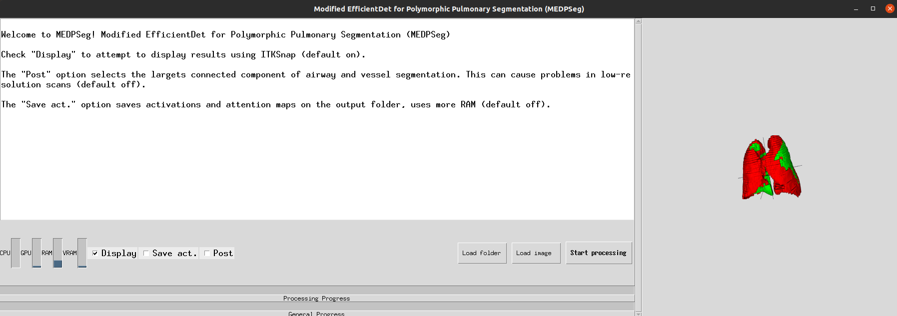
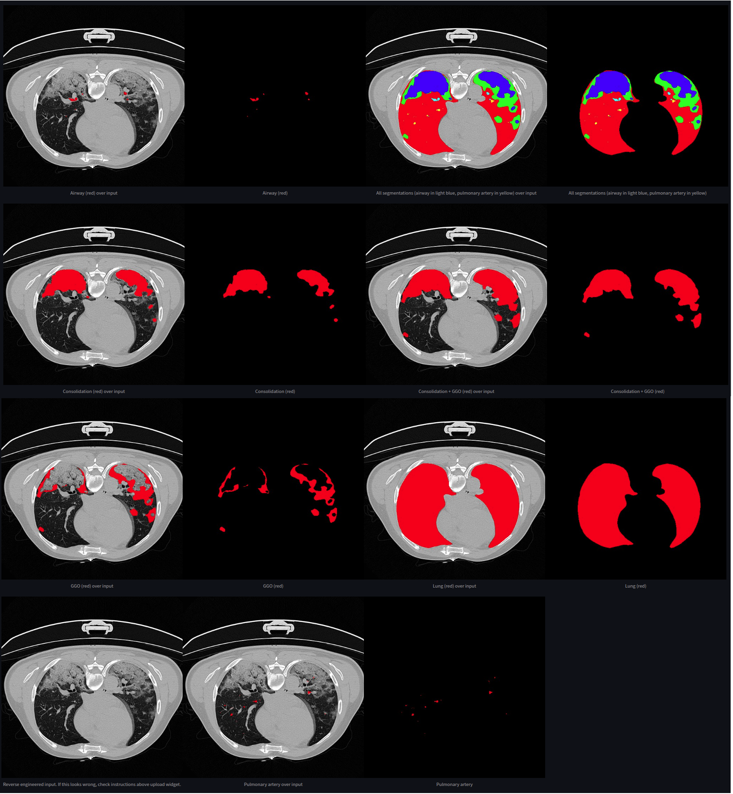

# MEDPSeg: End-to-end segmentation of pulmonary structures and lesions in computed tomography

Welcome to MEDPSeg (Modified EfficientDet for Polymorphic Pulmonary Segmentation). This is a new version of our old [MEDSeg](https://github.com/MICLab-Unicamp/medseg ) methodology. The paper is currently under submission, and full code and implementation will be available soon.

In the meantime, please refer to the old methodology! https://github.com/MICLab-Unicamp/medseg 

## Citation

UNDER SUBMISSION (arXiv soon)

## Running

Detailed instructions will be available soon. MEDPSeg will be available for installation through pip. Following is how the graphical user interface will look like: 

Outputs will include a general report in the form of a .csv sheet and the masks for all targets in .nii.gz format. Below is a rendering for PARSE scan 013 and CoronaCases scan 003.

||
|:--:| 
|*Outputs for PARSE013*|

||
|:--:| 
|*Outputs for CoronaCases003*|

Following are results of running in on slice 100 of coronacases ID: 003. Note that airway and pulmonary artery performance might be lower in single slice prediction, since those are volumetric tubular structures usually segmented in high resolution 3D CT. 

